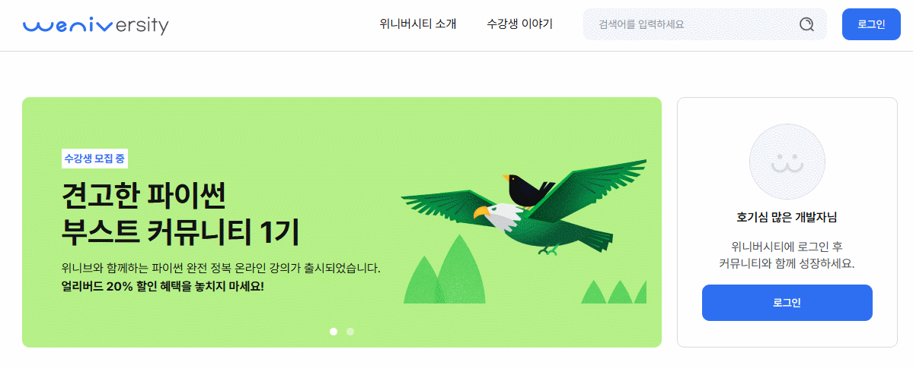

# 🎓Weniversity

<div align="center">
  
</div>

> https://weniversity.netlify.app/ > <br/>

<br/>

# 📑목차

- [📌 프로젝트 개요](#-프로젝트-개요)
- [🔥 팀 소개](#-팀-소개)
- [🛠 기술 스택 및 개발환경](#-기술-스택-및-개발환경)
- [📄 요구사항 및 기능 명세](#-요구사항-및-기능-명세)
- [🔗 API 문서](#-api-문서)
- [📅 프로젝트 구조 및 개발 일정](#-프로젝트-구조-및-개발-일정)
- [🗄 데이터베이스 모델링 (ERD)](#-데이터베이스-모델링-erd)
- [📺 구현 페이지](#-구현-페이지)
- [🐞 현재 문제점](#-현재-문제점)
- [🔍 프로젝트 회고](#-프로젝트-회고)

# 📌 프로젝트 개요

- **Weniversity 프로젝트**는 ICT 분야 동영상 강의 시청 및 관리 플랫폼 개발 프로젝트 입니다. FE개발자 3인, BE개발자 1인의 협업으로 진행되었습니다.
- **진행 기간:** 2025.07.28 ~ 2025.08.17

# 🔥 팀 소개

- Team. 이것첫번째레슨

  |              [김여밈](https://github.com/yeo-meme)               |               [최재호](https://github.com/jaeho614)               |               [이혜민](https://github.com/100gun)               |               [최나영](https://github.com/nanna0)               |
  | :--------------------------------------------------------------: | :---------------------------------------------------------------: | :-------------------------------------------------------------: | :-------------------------------------------------------------: |
  |  |  |  |  |
  |                             FE, 팀장                             |                                FE                                 |                               FE                                |                               BE                                |
  |                          담당 역할 상세                          |                          담당 역할 상세                           |                         담당 역할 상세                          |                         담당 역할 상세                          |

# 🛠 기술 스택 및 개발환경

## Development Tools


## Frontend


### 배포 (Frontend)


## Backend


### DB


(개발기본)

### 배포 (Backend)


## Project Management


## 협업 방식

- **브랜치 전략**
  - `feature/*` → `staging` → `develop` → `main`
  - 기능 단위로 브랜치 생성 후 PR, 리뷰, 머지 진행
- **커밋 컨벤션**
  - `feat`, `fix`, `docs`, `style`, `refactor`, `test`, `chore` 등
  - 상세 컨벤션은 노션 협업 페이지 내 [git rule 페이지](https://www.notion.so/git-rule-23effc9d5694809387a3f1169132848a) 참고
- **PR/리뷰**
  - 기능 완료 후 PR 생성 → 코드 리뷰 → 머지
  - 필요 시 브랜치 삭제
- **커뮤니케이션**
  - **📑 Notion**: 프로젝트 기획, 일정 관리, 회의록 기록 등 문서화 작업
  - **💬 Discord**: 실시간 소통 및 팀 간 문의, 알림, 스크럼 회의

# 📄 요구사항 및 기능 명세

★필요시 작성 및 보강

## 요구사항

- 요구사항 문서는 [여기](https://www.notion.so/1ceebf76ee8a81759905ef6c45fc9468?pvs=21)에서 확인해주세요.

## 기능 명세

- 사용자 관리
  - 회원가입, 사용자 로그인, 사용자 로그아웃, 관리자 로그인, 관리자 로그아웃
- 과목 관리
- 동영상 학습 시스템
- 미션 및 평가 시스템

# 🔗 API 문서

- 서버 IP: http://13.125.180.222/

## API 명세

- 앱 분리 구조

  | 앱 이름        | 역할 설명                                |
  | -------------- | ---------------------------------------- |
  | `users`        | 회원가입, 로그인, 역할 구분, 사용자 정보 |
  | `courses`      | 강의, 영상, 분류 관리                    |
  | `enrollments`  | 수강 등록 및 수강 상태                   |
  | `missions`     | 과제/문제 및 제출/채점                   |
  | `certificates` | 수료증 생성 및 다운로드                  |
  | `progress`     | 영상 진도율, 시청 기록                   |
  | `analytics`    | 관리자 대시보드: 통계, 접속 로그         |

### User API (완료)

| 기능                      | 메서드    | 엔드포인트                           | 비고                                                                                          |
| ------------------------- | --------- | ------------------------------------ | --------------------------------------------------------------------------------------------- |
| 회원가입                  | POST      | `/api/users/register/`               |                                                                                               |
| 로그인(JWT)               | POST      | `/api/users/login/`                  |                                                                                               |
| 토큰 리프레시             | POST      | `/api/users/refresh/`                |                                                                                               |
| 로그아웃                  | POST      | `/api/users/logout/`                 | Headers: access, refresh 토큰                                                                 |
| 마이페이지 조회/수정      | GET / PUT | `/api/users/mypage/`                 | GET: Authorization: Bearer <access_token>, PUT: multipart/form-data로 profile_image 포함 가능 |
| 비밀번호 변경             | PATCH     | `/api/users/mypage/change-password/` | Body: {"current_password": "...", "new_password": "..."}                                      |
| 비밀번호 변경 이메일 발송 | POST      | `/api/password-reset/`               | Body: {"email": "..."}                                                                        |
| 내가 좋아요한 코스 리스트 | GET       | `/api/users/mypage/likes/`           | 로그인 필요                                                                                   |

### 강의/영상 (완료)

| 기능             | 메서드 | 엔드포인트                           | 비고                                               |
| ---------------- | ------ | ------------------------------------ | -------------------------------------------------- |
| 강의 목록        | GET    | `/api/courses/`                      |                                                    |
| 강의 상세        | GET    | `/api/courses/<id>/`                 | chapter, video 목록까지 조회 가능                  |
| 강의 필터        | GET    | `/api/courses/?`                     | title, level, category, type, price_type 필터 지원 |
| 강의 좋아요      | POST   | `/api/courses/<int:course_id>/like/` | 로그인 필요                                        |
| 강의 좋아요 취소 | DELETE | `/api/courses/<int:course_id>/like/` | 로그인 필요                                        |

### 수강등록/진도 (완료)

| 기능              | 메서드 | 엔드포인트                             | 비고                                                                 |
| ----------------- | ------ | -------------------------------------- | -------------------------------------------------------------------- |
| 내 수강 강의      | GET    | `/api/my-courses/`                     | Headers: Authorization: Bearer <access_token>, type/status 필터 가능 |
| 수강 신청         | POST   | `/api/courses/enroll/<int:course_id>/` | Headers: Authorization: Bearer <access_token>                        |
| 내 수강 강의 필터 | GET    | `/api/my-courses/?`                    | Headers: Authorization: Bearer <access_token>, type/status 필터 가능 |

### 문제풀이

| 기능         | 메서드 | 엔드포인트                   |
| ------------ | ------ | ---------------------------- |
| 문제 목록    | GET    | `/api/missions/<course_id>/` |
| 답안 제출    | POST   | `/api/submissions/`          |
| 내 채점 결과 | GET    | `/api/submissions/my/`       |

### 수료증

| 기능                | 메서드 | 엔드포인트                                |
| ------------------- | ------ | ----------------------------------------- |
| 수료증 보기         | GET    | `/api/certificates/my/`                   |
| 수료증 PDF 다운로드 | GET    | `/api/certificates/<course_id>/download/` |

## 권한 구조

| 구분   | 권한                                             |
| ------ | ------------------------------------------------ |
| 수강생 | 강의 열람, 수강 신청, 미션 제출, 수료증 조회     |
| 관리자 | 강의 등록/수정/삭제, 모든 사용자 관리, 통계 조회 |

# 📅 프로젝트 구조 및 개발 일정

## 프로젝트 구조

 <!-- 임시 구조 트리입니다. 수정 필요 -->

```
📦weniversity-web
┣ 📂dist
┣ 📂public
┣ 📂src
┃ ┣ 📂assets          #이미지
┃ ┣ 📂auth
┃ ┣ 📂components
┃ ┣ 📂hooks
┃ ┣ 📂page
┃ ┃ ┣ 📂login
┃ ┃ ┗ 📂my-lectures
┃ ┣ 📂store
┃ ┃ ┗ 📂slices
┃ ┣ 📂types
┃ ┣ 📜App.css
┃ ┣ 📜App.tsx
┃ ┣ 📜AppContent.tsx
┃ ┣ 📜index.css
┃ ┣ 📜main.tsx
┃ ┗ 📜vite-env.d.ts
┣ 📜.gitignore
┣ 📜eslint.config.js
┣ 📜index.html
┣ 📜package-lock.json
┣ 📜package.json
┣ 📜postcss.config.js
┣ 📜README.md
┣ 📜setup-redux.sh
┣ 📜setup.sh
┣ 📜tailwind.config.js
┣ 📜tsconfig.app.json
┣ 📜tsconfig.json
┣ 📜tsconfig.node.json
┗ 📜vite.config.ts
```

## WBS

 <!-- 추가 -->

# 🗄 데이터베이스 모델링 (ERD)

 <!-- ERD 다이어그램 첨부 -->

# 📺 구현 페이지

- 메인 페이지 (로그인 전/후)
- 로그인 페이지
- 회원가입 페이지
- 마이페이지
- 내 강의 목록 페이지 (/my-lecture)
- 강의 상세 페이지

### 공통 기능

- 좋아요 기능
- 빈 카드 스켈레톤UI
- 이미지 업데이트

## 페이지별 주요 기능

-
-

## 프로젝트 시연 영상

 <!-- 하단 gif 첨부 필요 -->

### 🔐비로그인 상태

- 메인 캐러셀 슬라이드
  <br/>
  
- 메인 섹션 카테고리 클릭 → 페이지 이동
  <br/>
  
- 필터 선택 → 리스트 반영, 초기화 버튼 클릭 시 전체 필터 선택 해제
  <br/>
  
  - 한 페이지에 9개 리스트 노출, 페이지네이션 구현, 10개가 되지 않으면 페이지네이션 ui 숨김
    <br/>
    
- 강의 카드 클릭 → 상세페이지 이동 (강의 카드의 좋아요 버튼은 비로그인 상태라 보이지 않음)
  <br/>
  

### 📝회원가입

- 각 input 유효성 검사
  <br/>
  
- 모든 조건 충족 시 버튼 활성화
  <br/>
  
- 가입 이메일 중복 체크
  <br/>
  

### 🔑로그인 후 상태

- 프로필 카드/헤더 변화
  <br/>
  
- 좋아요 버튼 클릭 → 색상 채움/해제
  <br/>
  
- 마이페이지 이미지 변경 & 미리보기
  <br/>
  
- 비밀번호 재설정
  <br/>
  
- 내 강의 목록 카드 클릭 → 상세페이지 이동 (내 강의 목록에서는 좋아요가 보이지 않음)
  <br/>
  
- 수강신청 중복 알림
  <br/>
  

### 🌐공통 UI / 기타

- 로그인/비로그인 접근 제한
  - 라우터 확인 → 로그인 필요 페이지 (ex. /my-lecture) 접근 시 로그인 페이지로 이동
    <br/>
    
- 페이지 로딩 시 Skeleton UI
  <br/>
  
- 필터 적용 후 좋아요 상태 반영
  <br/>
  

# 🐞 현재 문제점

- **내 강의 목록 페이지 스크롤**
  - 수강신청 후 페이지 이동 시 스크롤 위치가 상단으로 초기화되지 않음
- **마이페이지 이미지 업데이트**
  - 마이페이지에서 이미지 변경 후 헤더, 프로필 카드에 바로 반영되지 않음
  - 재로그인 시 정상 적용
- **커리큘럼 / 강의 데이터 미입력**
  - 상세페이지 및 내 강의 목록 일부 강의 정보 미입력
  - DB 데이터 입력 시 해결
- **비밀번호 재설정 CORS 오류**
  - 현재 개발 환경에서 비밀번호 재설정 후 오류 발생
  - 변경 후 로그인 페이지 이동 예정
- **공유하기 버튼**
  - 버튼만 구현, 기능 미개발
- **강의 상세페이지 수강완료 체크 기능 미구현**

# 🔍 프로젝트 회고

## 개선 목표

 <!-- 추가 -->

## 트러블슈팅

 <!-- 추가 -->

## 개인 회고

### ⭐김여밈

<aside>내용을 입력해주세요</aside>

### ⭐최재호

<aside>내용을 입력해주세요</aside>

### ⭐이혜민

<aside>내용을 입력해주세요</aside>

### ⭐최나영

<aside>내용을 입력해주세요</aside>
