# 🎓Weniversity

<div align="center">
  
</div>

> https://weniversity.netlify.app/ <br/>

<br/>

# 📑목차

- [📌 프로젝트 개요](#-프로젝트-개요)
- [🔥 팀 소개](#-팀-소개)
- [🛠 기술 스택 및 개발환경](#-기술-스택-및-개발환경)
- [📄 요구사항 및 기능 명세](#-요구사항-및-기능-명세)
- [🔗 API 문서](#-api-문서)
- [📅 프로젝트 구조 및 개발 일정](#-프로젝트-구조-및-개발-일정)
- [🗄 데이터베이스 모델링 (ERD)](#-데이터베이스-모델링-erd)
- [📺 구현 페이지](#-구현-페이지)
- [🐞 현재 문제점](#-현재-문제점)
- [🔍 프로젝트 회고](#-프로젝트-회고)

# 📌 프로젝트 개요

- **Weniversity 프로젝트**는 ICT 분야 동영상 강의 시청 및 관리 플랫폼 개발 프로젝트 입니다. FE개발자 3인, BE개발자 1인의 협업으로 진행되었습니다.
- **진행 기간:** 2025.07.28 ~ 2025.08.17

# 🔥 팀 소개

- Team. 이건첫번째레슨

  |              [김여밈](https://github.com/yeo-meme)               |               [최재호](https://github.com/jaeho614)               |               [이혜민](https://github.com/100gun)               |               [최나영](https://github.com/nanna0)               |
  | :--------------------------------------------------------------: | :---------------------------------------------------------------: | :-------------------------------------------------------------: | :-------------------------------------------------------------: |
  |  |  |  |  |
  |                             FE, 팀장                             |                                FE                                 |                               FE                                |                               BE                                |
  |                          담당 역할 상세                          |                          담당 역할 상세                           |                         담당 역할 상세                          |                         담당 역할 상세                          |

# 🛠 기술 스택 및 개발환경

## Development Tools


## Frontend


### 배포 (Frontend)


## Backend


### DB


### 배포 (Backend)

   

## Project Management


## 협업 방식

- **브랜치 전략**
  - `feature/*` → `staging` → `develop` → `main`
  - 기능 단위로 브랜치 생성 후 PR, 리뷰, 머지 진행
- **커밋 컨벤션**
  - `feat`, `fix`, `docs`, `style`, `refactor`, `test`, `chore` 등
  - 상세 컨벤션은 노션 협업 페이지 내 [git rule 페이지](https://www.notion.so/git-rule-23effc9d5694809387a3f1169132848a) 참고
- **PR/리뷰**
  - 기능 완료 후 PR 생성 → 코드 리뷰 → 머지
  - 필요 시 브랜치 삭제
- **커뮤니케이션**
  - **📑 Notion**: 프로젝트 기획, 일정 관리, 회의록 기록 등 문서화 작업
  - **💬 Discord**: 실시간 소통 및 팀 간 문의, 알림, 스크럼 회의

# 📄 요구사항 및 기능 명세

## 요구사항

- 요구사항 문서는 [여기](https://www.notion.so/1ceebf76ee8a81759905ef6c45fc9468?pvs=21)에서 확인해주세요.

## 기능 명세

- 사용자 관리
  - 회원가입, 사용자 로그인, 사용자 로그아웃, 관리자 로그인, 관리자 로그아웃
- 과목 관리
- 동영상 학습 시스템
- 미션 및 평가 시스템

# 🔗 API 문서

- 서버 IP: http://13.125.180.222/

## API 명세

### user

| Description                      | HTTP Method  | URL Pattern Endpoint                 | Authentication | note          |
| -------------------------------- | ------------ | ------------------------------------ | -------------- | ------------- |
| 회원가입                         | `POST`       | `/api/users/register/`               |                |               |
| 로그인(JWT)                      | `POST`       | `/api/users/login/`                  |                | refresh token |
| 토큰리프레쉬                     | `POST`       | `/api/users/refresh/`                | **✅**         | refresh token |
| 로그아웃                         | `POST`       | **`/api/users/logout/`**             | **✅**         |               |
| 마이페이지(프로필사진) 조회/변경 | `GET`/ `PUT` | `/api/users/mypage/`                 | **✅**         |               |
| 비밀번호 변경                    | `PATCH`      | `/api/users/mypage/change-password/` | **✅**         |               |
| 비밀번호 변경 이메일 발송        | `POST`       | `api/password-reset/`                | **✅**         |               |
| 내가 좋아요한 코스 리스트        | `GET`        | `api/users/mypage/likes/`            | **✅**         |               |

### 강의/영상

| Description      | HTTP Method | URL Pattern Endpoint               | Authentication | note |
| ---------------- | ----------- | ---------------------------------- | -------------- | ---- |
| 강의 목록        | `GET`       | `/api/courses/`                    |                |      |
| 강의 상세        | `GET`       | `/api/courses/<id>/`               |                |      |
| 강의 필터        | `GET`       | `/api/courses/?`                   |                |      |
| 강의 좋아요      | `POST`      | `/api/courses/int:course_id/like/` | **✅**         |      |
| 강의 좋아요 취소 | `DELETE`    | `/api/courses/int:course_id/like/` | **✅**         |      |

### 수강 등록/진도

| Description       | HTTP Method | URL Pattern Endpoint                   | Authentication | note |
| ----------------- | ----------- | -------------------------------------- | -------------- | ---- |
| 내 수강 강의      | `GET`       | `/api/my-courses/`                     | **✅**         |      |
| 수강 신청         | `POST`      | `/api/courses/enroll/<int:course_id/>` | **✅**         |      |
| 내 수강 강의 필터 | `GET`       | `/api/my-courses/?`                    | **✅**         |      |

## 권한 구조

| 구분   | 권한                                             |
| ------ | ------------------------------------------------ |
| 수강생 | 강의 열람, 수강 신청, 미션 제출, 수료증 조회     |
| 관리자 | 강의 등록/수정/삭제, 모든 사용자 관리, 통계 조회 |

# 📅 프로젝트 구조 및 개발 일정

## FE 프로젝트 구조

repository: https://github.com/yeo-meme/weniversity-web

```
📦weniversity-web
┣ 📂dist
┣ 📂public
┃ ┣ 📂images            #README용 이미지
┣ 📂src
┃ ┣ 📂assets
┃ ┣ 📂auth (로그인 관련)
┃ ┣ 📂components
┃ ┃ ┣ 📂common
┃ ┃ ┣ 📂course
┃ ┃ ┣ 📂courseDetail
┃ ┃ ┣ 📂footer
┃ ┃ ┣ 📂header
┃ ┃ ┣ 📂hero
┃ ┃ ┣ 📂home
┃ ┃ ┣ 📂mission
┃ ┃ ┣ 📂myLectures
┃ ┃ ┣ 📂myPage
┃ ┃ ┣ 📂reigister
┃ ┃ ┗ 📂video
┃ ┣ 📂hooks (redux-toolkit 정의)
┃ ┣ 📂page (페이지 관리)
┃ ┃ ┣ 📂course
┃ ┃ ┣ 📂courseDetail
┃ ┃ ┣ 📂login
┃ ┃ ┣ 📂main
┃ ┃ ┣ 📂myLectures
┃ ┃ ┣ 📂mypage
┃ ┃ ┣ 📂register
┃ ┃ ┣ 📂search
┃ ┃ ┗ 📜NotFoundPage.tsx
┃ ┣ 📂services (유틸리티)
┃ ┃ ┣ 📂mypage
┃ ┃ ┣ 📂register
┃ ┃ ┗ 📂video
┃ ┣ 📂store (API 관련)
┃ ┣ 📂types (type 정의)
┃ ┃ ┣ 📂course
┃ ┃ ┣ 📂courseDetail
┃ ┃ ┣ 📂mission
┃ ┃ ┣ 📂myLectures
┃ ┃ ┣ 📂mypage
┃ ┃ ┣ 📂register
┃ ┃ ┣ 📂search
┃ ┃ ┗ 📂video
┃ ┣ 📂utils
┃ ┣ 📜App.css
┃ ┣ 📜App.tsx
┃ ┣ 📜AppContent.tsx
┃ ┣ 📜index.css
┃ ┣ 📜main.tsx
┃ ┗ 📜vite-env.d.ts
┣ 📜.gitignore
┣ 📜eslint.config.js
┣ 📜index.html
┣ 📜package-lock.json
┣ 📜package.json
┣ 📜postcss.config.js
┣ 📜README.md
┣ 📜setup-redux.sh
┣ 📜setup.sh
┣ 📜tailwind.config.js
┣ 📜tsconfig.app.json
┣ 📜tsconfig.json
┣ 📜tsconfig.node.json
┗ 📜vite.config.ts
```

## BE 프로젝트 구조

repository: https://github.com/nanna0/weniversity-server

```
📦weniversity-server
┣ app/ # Django project root
┣ 📂.github
┃ ┣ 📂workflows
┃ ┃ ┣ 📜main.yaml
┣ 📂venv
┣ 📂weniversity
┃ ┣ 📜**init**.py
┃ ┣ 📜asgi.py
┃ ┣ 📜settings.py
┃ ┣ 📜urls.py
┃ ┣ 📜wsgi.py
┃ 📜.env
┃ 📜.gitignore
┃ 📜db.sqlite3
┃ 📜manage.py
┃ 📜README.md
┃ 📜requirements.txt
┣ 📂media
┃ ┣ 📂course
┃ ┣ 📂instructor_profiles
┃ ┣ 📂profiles
┃ ┣ 📂video
┣ 📂users
┃ ┣ 📂migrations
┃ ┃ ┣ 📜**init**.py
┃ ┣ 📂templates
┃ ┃ ┣ 📂emails
┃ ┃ ┃ ┣ 📜password_reset_form.html
┃ ┣ 📜**init**.py
┃ ┣ 📜admin.py
┃ ┣ 📜models.py
┃ ┣ 📜permissions.py
┃ ┣ 📜serializers.py
┃ ┣ 📜urls.py
┃ ┣ 📜views.py
┣ 📂courses
┃ ┣ 📂migrations
┃ ┃ ┣ 📜**init**.py
┃ ┣ 📜**init**.py
┃ ┣ 📜admin.py
┃ ┣ 📜filters.py
┃ ┣ 📜models.py
┃ ┣ 📜serializers.py
┃ ┣ 📜urls.py
┃ ┣ 📜views.py
```

## WBS

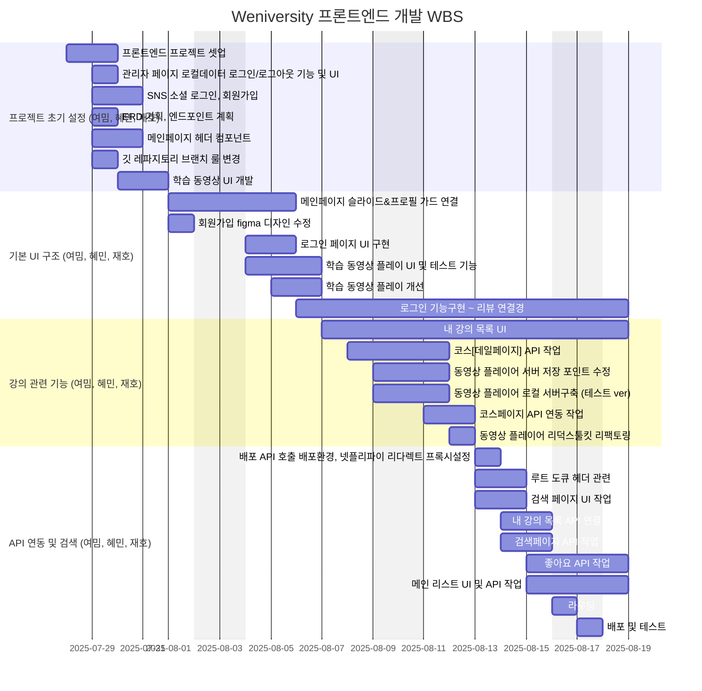


# 🗄 데이터베이스 모델링 (ERD)


# 📺 구현 페이지

- 메인 페이지
- 로그인 페이지
- 회원가입 페이지
- 마이페이지
- 내 강의 목록 페이지
- 강의 상세 페이지
- 검색 페이지

## 🌟 메인 기능

- **👤 사용자 관리**:

  - JWT와 리프레시 토큰을 통해 안전하고 효율적인 사용자 인증 및 권한 관리 기능을 구현했습니다.
  - 회원가입, 로그인, 로그아웃, 비밀번호 찾기 이메일 발송 기능을 제공합니다.
  - 사용자 역할은 관리자, 수강생으로 구분됩니다.

- **📚 강의 관리**:

  - 코스, 챕터, 비디오 3depth로 강의를 관리합니다.
  - 강의 유형별, 레벨별, 가격별, 분야별 필터 다중 검색 기능을 지원합니다.
  - 수강신청 및 수강 기간을 관리하며 내가 수강중인 강의 역시 유형별, 가격별로 필터 다중 검색을 지원합니다.
  - 강의 좋아요 기능과 내가 좋아요한 강의를 따로 조회할 수 있습니다.

- **🧑🏻‍🏫 강사 관리**:

  - 관리자가 강사 프로필을 등록/수정/삭제/조회 관리할 수 있습니다.

- **🎥 동영상 학습 시스템**:

  -

- **📈 학습 진행 관리**:

  - 사용자는 자신의 학습 진행 상황을 확인하고, 동영상 시청 기록을 관리할 수 있습니다.

- **🔒 권한 관리**:

  - 관리자와 사용자 역할에 따른 권한을 설정하고 관리할 수 있습니다.

- ## **📝 미션 평가 시스템**:

## 프로젝트 시연 영상

### 🔐비로그인 상태

- 메인 캐러셀 슬라이드
  <br/>
  
- 메인 섹션 카테고리 클릭 → 페이지 이동
  <br/>
  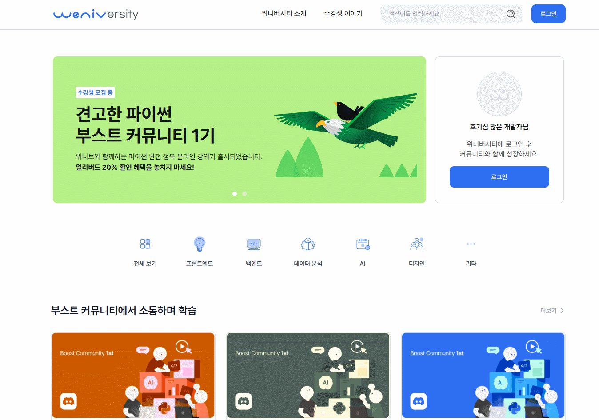
- 카드 더보기 클릭 → 페이지 이동
  <br/>
  
- 필터 선택 → 리스트 반영, 초기화 버튼 클릭 시 전체 필터 선택 해제
  <br/>
  
  - 한 페이지에 9개 리스트 노출, 페이지네이션 구현, 10개가 되지 않으면 페이지네이션 ui 숨김
    <br/>
    
- 강의 카드 클릭 → 상세페이지 이동 (강의 카드의 좋아요 버튼은 비로그인 상태라 보이지 않음)
  <br/>
  

### 📝회원가입

- 각 input 유효성 검사
  <br/>
  
- 모든 조건 충족 시 버튼 활성화
  <br/>
  
- 가입 이메일 중복 체크
  <br/>
  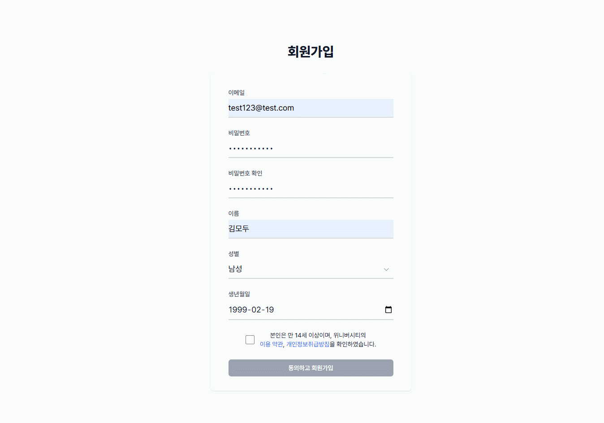

### 🔑로그인 후 상태

- 프로필 카드/헤더 변화
  <br/>
  
- 좋아요 버튼 클릭 → 색상 채움/해제
  <br/>
  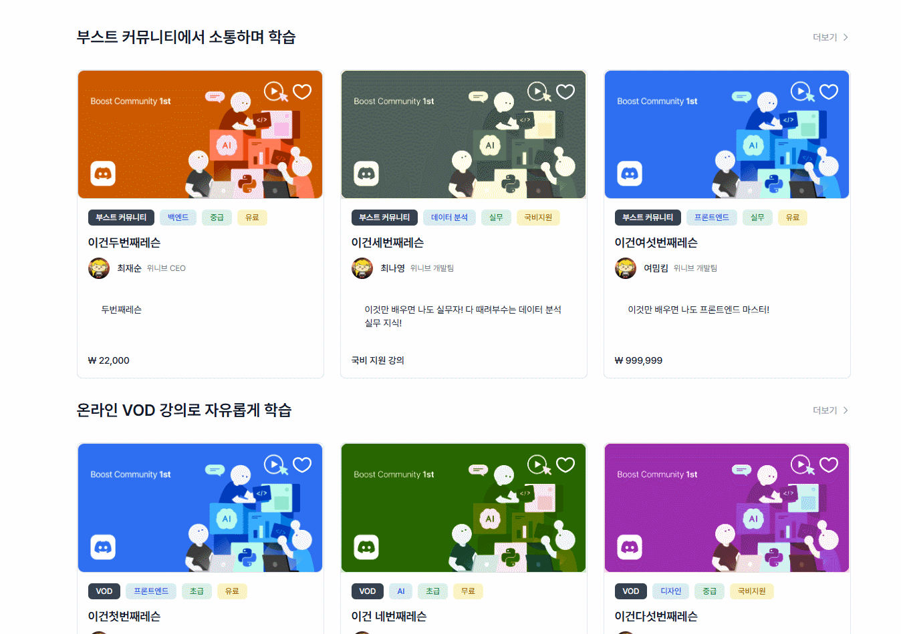
- 마이페이지 이미지 변경 & 미리보기
  <br/>
  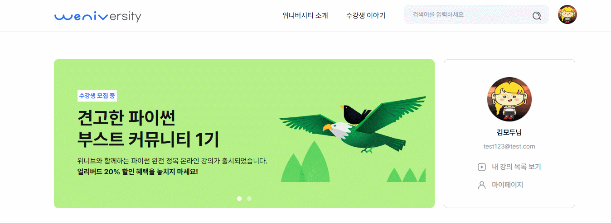
- 비밀번호 재설정 → 가입한 메일로 비밀번호 재설정 메일 발송, 비밀번호 변경 가능
  <br/>
  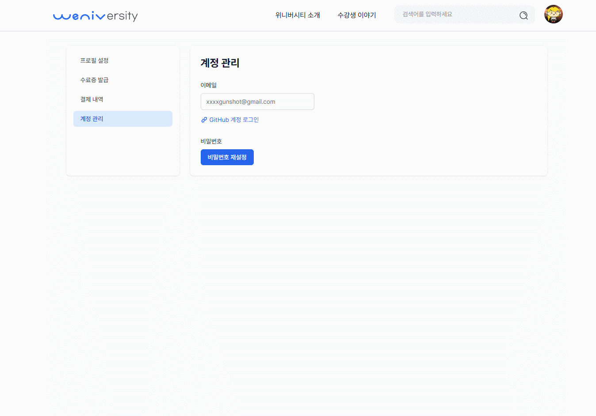
  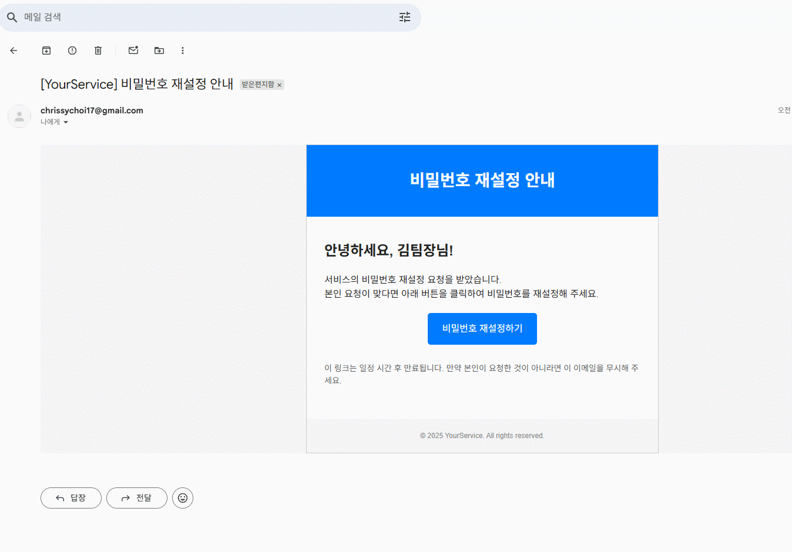
- 내 강의 목록 카드 클릭 → 상세페이지 이동 (내 강의 목록에서는 좋아요가 보이지 않음)
  <br/>
  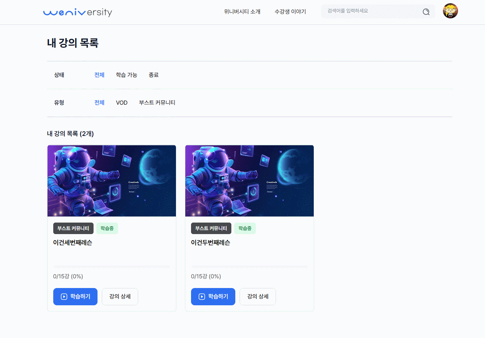
- 수강신청
  <br/>
  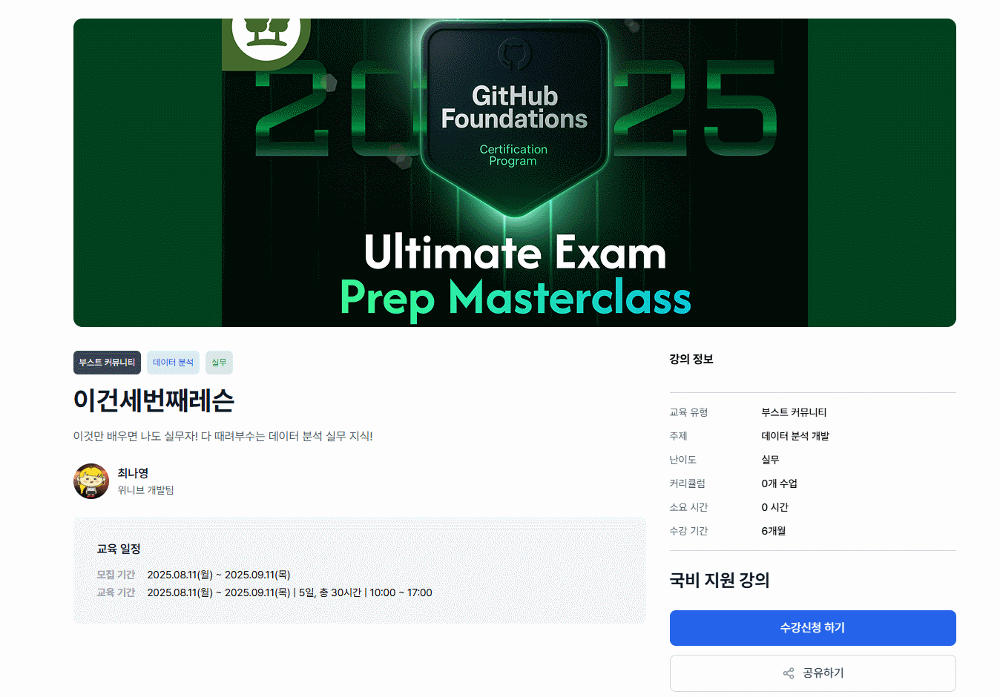
- 상세페이지 이미지 상단 수강신청 버튼
  <br/>
  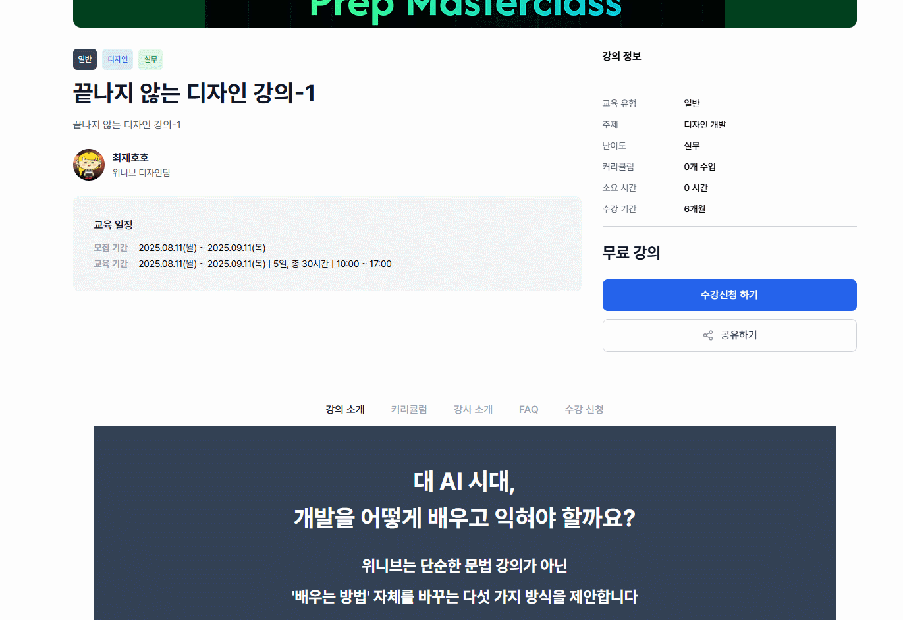
- 수강신청 중복 알림
  <br/>
  

### 🌐공통 UI / 기타

- 로그인/비로그인 접근 제한
  - 라우터 확인 → 로그인 필요 페이지 (ex. /my-lecture) 접근 시 로그인 페이지로 이동
    <br/>
    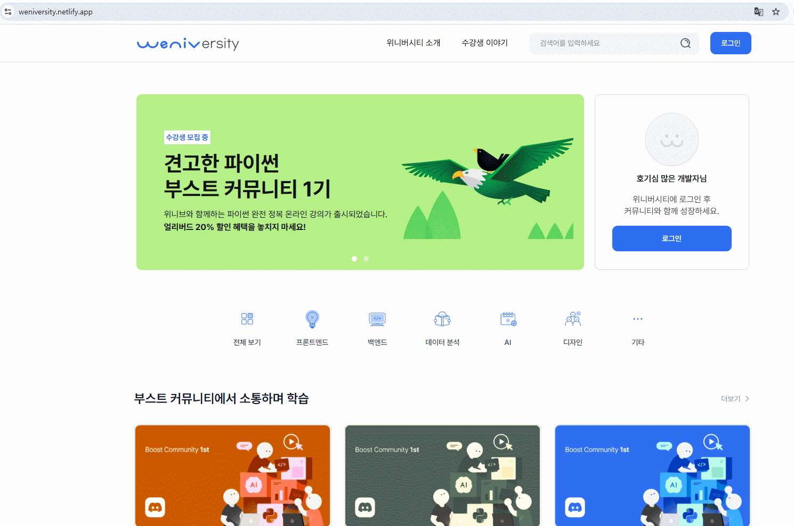
- 페이지 로딩 시 Skeleton UI
  <br/>
  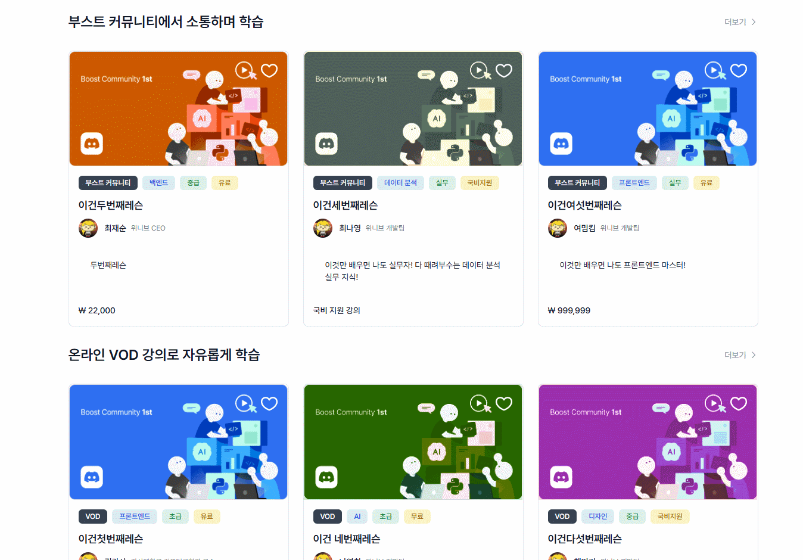
- 필터 적용 후 좋아요 상태 반영
  <br/>
  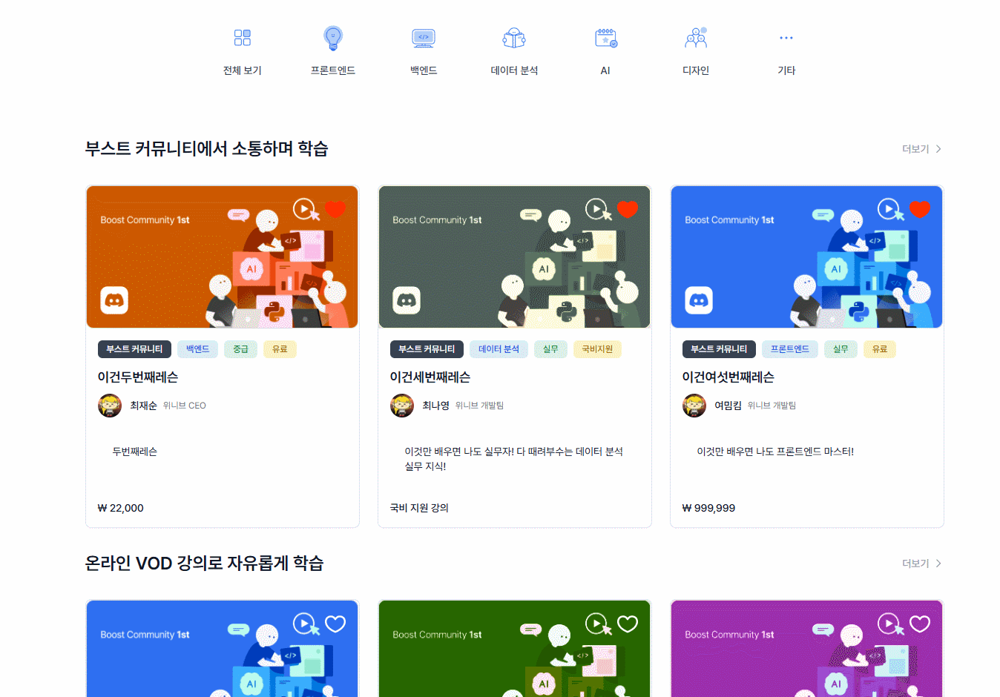
- 상세페이지 이미지 상단의 메뉴 클릭 시 해당 섹션으로 이동, FAQ 아코디언
  <br/>
  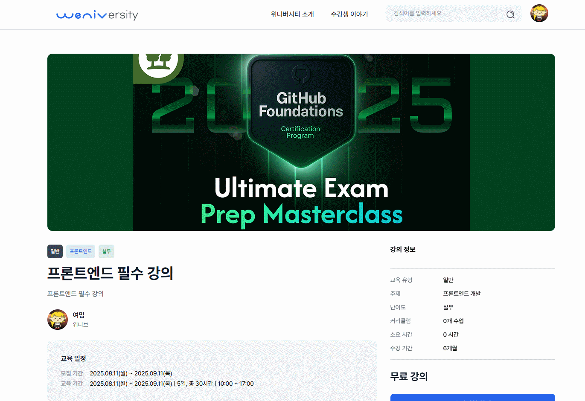

# 🐞 현재 문제점

- **내 강의 목록 페이지 스크롤**
  - 수강신청 후 페이지 이동 시 스크롤 위치가 상단으로 초기화되지 않음
- **마이페이지 이미지 업데이트**
  - 마이페이지에서 이미지 변경 후 헤더, 프로필 카드에 반영되지 않음
- **커리큘럼 / 강의 데이터 미입력**
  - 상세페이지 및 내 강의 목록 일부 강의 정보 미입력
  - DB 데이터 입력 시 해결
- **공유하기 버튼**
  - 버튼만 구현, 기능 미개발
- **강의 상세페이지 수강완료 체크 기능 미구현**
- **이미지 파일 불러오기**
  - 배포시 이미지 파일이 저장된 경로로 불러오지 못하는 이슈

# 🔍 프로젝트 회고

## 개선 목표

- 리팩토링, 반응형 대응, 미구현된 기능 개발

## 개인 회고

### ⭐김여밈

<aside>프로젝트를 시작하자마자 하고 싶은 아이디어들이 정말 많았는데 시간이 아쉽게 느껴졌습니다. 고민했던 멋진 결과물을 더 많이 만들 수 있었을 텐데 하는 아쉬움도 있습니다.하지만 또 시간이 짧았기엔 경험을 하면서 이 시간동안 얻는 것들이 특별했습니다. 개발도 중요했지만 협업 룰이 중요하게 염두해두었습니다. 개발을 하는 동안 다른 것들을 뒤로하고 ‘몰입’이라는 경험을 다시 할 수 있어서 좋았고, 그 경험이 내가 좋아하던 수업을 듣는 즐거움 못지않게 팀원들과 함께 프로덕트를 만들어가는 경험을 우선했습니다. 이번 프로젝트를 통해 협업이 어색했지만 조금 적응할 수 있었고 한정된 시간 안에서도 협업하는 경험이 값졌던거 같습니다 혼자 개발하는 것외에 팀워크로 할 수 있는 경험들을 충분히 맛보기 위해 최선을 다했던거 같습니다<</aside>

### ⭐최재호

<aside>프로젝트의 방대한 양에 구현을 다 할 수 있을까? 라는 의문이 들었습니다. 하지만 프로젝트를 진행하며 팀원들과 함께라면 필수과제는 구현할 수 있을 것이라는 생각이 들었습니다.
실력이 부족하지만 팀원들과 소통을 잘 한다면 최선의 결과를 만들어낼 수 있을 거라고 생각하며 열심히 프로젝트에 임했습니다.
처음 사용해보는 typescript와 redux-toolkit을 이번 프로젝트를 통해 조금은 공부할 수 있게 된것과 팀원들과의 소통이 저의 성장에 좋은 기회가 되었다고 생각합니다.<aside>

### ⭐이혜민

<aside>프론트엔드와 백엔드 연동, 상태 관리, 팀 협업 과정을 직접 경험하며 실제 서비스가 어떻게 개발되는지에 대한 흐름을 알게되어 좋았습니다. 이번 팀 프로젝트는 책임감을 가지고 문제에 임하는 자세를 다시 한번 상기하는 기회가 되었으며 앞으로 더 나은 방향으로 팀에 기여할 수 있도록 계속 노력할 예정입니다. 프로젝트를 진행하면서 잦은 실수로 팀에 부담을 준 것 같아 죄송한 마음이 아직도 크지만... 그만큼 더 많이 배우고 성장할 수 있었던 것 같습니다. 끝까지 응원해주신 팀장님과 팀원분들께 진심으로 감사드립니다!!</aside>

### ⭐최나영

<aside>구현해야 할 내용이 방대하여 막막했으나, 할 수 있는것과 해야 할 것을 구분하는 과정에서 팀원들과 원활한 소통으로 순조롭게 방향을 정할 수 있어서 감사했습니다.

부족한 실력이지만 반복적인 구현과 해보지 않은것에 대한 도전을 통해 나날이 성장함을 느꼈습니다.
가장 인상깊었던 작업은 사용자 인증 관리를 통해 JWT 인증 시스템을 구현하면서 Django REST Framework의 장점을 크게 느꼈고, permission 구현으로 권한 관리를 적용하며 이후 다시 프로젝트를 구성할 때 어떤식으로 접근하면 좋을지 감을 찾을 수 있었습니다.

또 실제 서비스를 구현하기 위해 어떻게 앱 구조를 효율적으로 구성해야 하는가 고민을 많이 하였는데 완벽하진 않지만 다시 돌아보니 아쉬운 부분과 개선점이 명확히 보일 정도로 구조적인 측면에서 크게 성장했음을 느꼈습니다.

이번 프로젝트를 통해 성장할 수 있었음에 감사하며, 앞으로 마주할 다양한 경험과 성장 또한 기대됩니다.
개발은 참 재밌습니다. 부족한 실력에 위축감이 들 때도 있지만 시간이 해결해줄 것이라 긍정적으로 생각하며 다가가면 너무나 재밌는 분야입니다.
다시 교육계로 돌아가 앞으로 만날 교육생들에게 더 의미있고 유익한 교육을 제공할 수 있을것이라 기대됩니다.

임신 기간동안 만삭이 다 될 때까지 대부분의 일상을 함께한 모두의 연구소 백엔드 과정, 성장을 위한 발걸음에 동행할 수 있어서 감사했습니다.</aside>
